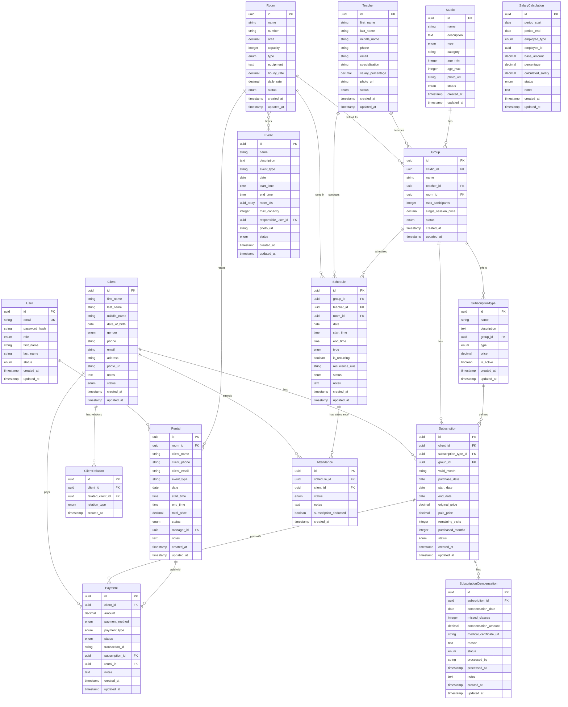

# Схема базы данных

## ERD (Entity Relationship Diagram)



## Индексы для оптимизации

### Client
```sql
CREATE INDEX idx_client_phone ON Client(phone);
CREATE INDEX idx_client_email ON Client(email);
CREATE INDEX idx_client_status ON Client(status);
CREATE INDEX idx_client_last_name ON Client(last_name);
```

### Schedule
```sql
CREATE INDEX idx_schedule_date ON Schedule(date);
CREATE INDEX idx_schedule_teacher ON Schedule(teacher_id);
CREATE INDEX idx_schedule_room ON Schedule(room_id);
CREATE INDEX idx_schedule_group ON Schedule(group_id);
CREATE INDEX idx_schedule_date_room ON Schedule(date, room_id);
```

### Attendance
```sql
CREATE INDEX idx_attendance_client ON Attendance(client_id);
CREATE INDEX idx_attendance_schedule ON Attendance(schedule_id);
CREATE INDEX idx_attendance_created ON Attendance(created_at);
```

### Payment
```sql
CREATE INDEX idx_payment_client ON Payment(client_id);
CREATE INDEX idx_payment_status ON Payment(status);
CREATE INDEX idx_payment_created ON Payment(created_at);
CREATE INDEX idx_payment_type ON Payment(payment_type);
```

### Subscription
```sql
CREATE INDEX idx_subscription_client ON Subscription(client_id);
CREATE INDEX idx_subscription_group ON Subscription(group_id);
CREATE INDEX idx_subscription_status ON Subscription(status);
CREATE INDEX idx_subscription_valid_month ON Subscription(valid_month);
CREATE INDEX idx_subscription_dates ON Subscription(start_date, end_date);
-- Composite index для поиска абонементов клиента по месяцу
CREATE INDEX idx_subscription_client_month ON Subscription(client_id, valid_month);
```

### SubscriptionCompensation
```sql
CREATE INDEX idx_subscription_compensation_subscription ON SubscriptionCompensation(subscription_id);
CREATE INDEX idx_subscription_compensation_status ON SubscriptionCompensation(status);
CREATE INDEX idx_subscription_compensation_date ON SubscriptionCompensation(compensation_date);
```

### Rental
```sql
CREATE INDEX idx_rental_date ON Rental(date);
CREATE INDEX idx_rental_room ON Rental(room_id);
CREATE INDEX idx_rental_manager ON Rental(manager_id);
CREATE INDEX idx_rental_status ON Rental(status);
```

### UserInvitation
```sql
CREATE UNIQUE INDEX idx_user_invitation_token ON UserInvitation(token);
CREATE INDEX idx_user_invitation_user ON UserInvitation(user_id);
CREATE INDEX idx_user_invitation_expires ON UserInvitation(expires_at);
```

### PasswordResetToken
```sql
CREATE UNIQUE INDEX idx_password_reset_token ON PasswordResetToken(token);
CREATE INDEX idx_password_reset_user ON PasswordResetToken(user_id);
CREATE INDEX idx_password_reset_expires ON PasswordResetToken(expires_at);
```

### AuditLog
```sql
CREATE INDEX idx_audit_log_user ON AuditLog(user_id);
CREATE INDEX idx_audit_log_entity_type ON AuditLog(entity_type);
CREATE INDEX idx_audit_log_entity_id ON AuditLog(entity_id);
CREATE INDEX idx_audit_log_action ON AuditLog(action);
CREATE INDEX idx_audit_log_created ON AuditLog(created_at);
-- Composite index для частого запроса: фильтр по пользователю + дате
CREATE INDEX idx_audit_log_user_created ON AuditLog(user_id, created_at DESC);
```

### Client (дополнительные индексы для юрлиц)
```sql
CREATE INDEX idx_client_type ON Client(client_type);
CREATE INDEX idx_client_inn ON Client(inn);
CREATE INDEX idx_client_company_name ON Client(company_name);
-- Composite index для поиска компаний
CREATE INDEX idx_client_type_company_name ON Client(client_type, company_name);
```

### CompanyContact
```sql
CREATE INDEX idx_company_contact_client ON CompanyContact(client_id);
CREATE INDEX idx_company_contact_phone ON CompanyContact(phone);
CREATE INDEX idx_company_contact_is_primary ON CompanyContact(client_id, is_primary);
```

### Rental (дополнительный индекс)
```sql
CREATE INDEX idx_rental_client ON Rental(client_id);
```

### RentalContract
```sql
CREATE INDEX idx_rental_contract_rental ON RentalContract(rental_id);
CREATE INDEX idx_rental_contract_number ON RentalContract(contract_number);
CREATE INDEX idx_rental_contract_date ON RentalContract(contract_date);
CREATE INDEX idx_rental_contract_status ON RentalContract(status);
```

---

## Пример Prisma Schema

```prisma
// schema.prisma

generator client {
  provider = "prisma-client-js"
}

datasource db {
  provider = "postgresql"
  url      = env("DATABASE_URL")
}

enum UserRole {
  ADMIN
  MANAGER
}

enum UserStatus {
  ACTIVE
  BLOCKED
}

model User {
  id            String      @id @default(uuid())
  email         String      @unique
  passwordHash  String?     @map("password_hash")  // Nullable для invite flow
  role          UserRole
  firstName     String      @map("first_name")
  lastName      String      @map("last_name")
  status        UserStatus  @default(BLOCKED)  // BLOCKED до активации через invite
  lastLoginAt   DateTime?   @map("last_login_at")  // Время последнего входа
  createdAt     DateTime    @default(now()) @map("created_at")
  updatedAt     DateTime    @updatedAt @map("updated_at")

  rentals       Rental[]
  events        Event[]
  auditLogs     AuditLog[]
  invitations   UserInvitation[]
  systemSettings SystemSettings[]

  @@map("users")
}

enum ClientStatus {
  ACTIVE
  INACTIVE
  VIP
}

enum Gender {
  MALE
  FEMALE
  OTHER
}

enum ClientType {
  INDIVIDUAL  // Физическое лицо
  COMPANY     // Юридическое лицо
}

model Client {
  id              String        @id @default(uuid())

  // Тип клиента
  clientType      ClientType    @default(INDIVIDUAL) @map("client_type")

  // Поля для ФИЗИЧЕСКИХ ЛИЦ (clientType = INDIVIDUAL)
  firstName       String?       @map("first_name")  // Обязательно для физлиц
  lastName        String?       @map("last_name")   // Обязательно для физлиц
  middleName      String?       @map("middle_name")
  dateOfBirth     DateTime?     @map("date_of_birth") @db.Date
  gender          Gender?

  // Поля для ЮРИДИЧЕСКИХ ЛИЦ (clientType = COMPANY)
  companyName     String?       @map("company_name")  // Обязательно для компаний
  inn             String?       // ИНН (10-12 цифр) - Обязательно для компаний
  kpp             String?       // КПП (9 цифр) - Опционально
  ogrn            String?       // ОГРН (13 цифр) - Опционально
  legalAddress    String?       @map("legal_address") @db.Text  // Юридический адрес

  // Банковские реквизиты (для компаний)
  bankAccount           String?   @map("bank_account")  // Расчетный счет (20 цифр)
  bankName              String?   @map("bank_name")     // Название банка
  bik                   String?   // БИК банка (9 цифр)
  correspondentAccount  String?   @map("correspondent_account")  // Корр. счет

  // Общие поля для всех
  phone           String
  email           String?
  address         String?       @db.Text  // Фактический адрес (для физлиц или почтовый для компаний)
  photoUrl        String?       @map("photo_url")
  notes           String?       @db.Text
  status          ClientStatus  @default(ACTIVE)
  createdAt       DateTime      @default(now()) @map("created_at")
  updatedAt       DateTime      @updatedAt @map("updated_at")

  // Relations
  relations       ClientRelation[] @relation("ClientRelations")
  relatedTo       ClientRelation[] @relation("RelatedClientRelations")
  subscriptions   Subscription[]
  attendances     Attendance[]
  payments        Payment[]
  rentals         Rental[]         // Аренды помещений (в основном для компаний)
  companyContacts CompanyContact[]  // Контактные лица для компаний

  @@index([phone])
  @@index([email])
  @@index([status])
  @@index([lastName])
  @@index([clientType])
  @@index([inn])
  @@index([companyName])
  @@map("clients")
}

enum RelationType {
  PARENT
  CHILD
  SPOUSE
  SIBLING
}

model ClientRelation {
  id                String        @id @default(uuid())
  clientId          String        @map("client_id")
  relatedClientId   String        @map("related_client_id")
  relationType      RelationType  @map("relation_type")
  createdAt         DateTime      @default(now()) @map("created_at")

  client            Client        @relation("ClientRelations", fields: [clientId], references: [id], onDelete: Cascade)
  relatedClient     Client        @relation("RelatedClientRelations", fields: [relatedClientId], references: [id], onDelete: Cascade)

  @@map("client_relations")
}

// Контактные лица для компаний (юридических лиц)
model CompanyContact {
  id          String    @id @default(uuid())
  clientId    String    @map("client_id")  // Ссылка на Client где clientType = COMPANY
  firstName   String    @map("first_name")
  lastName    String    @map("last_name")
  middleName  String?   @map("middle_name")
  position    String?   // Должность (например: "Директор", "Главный бухгалтер")
  phone       String
  email       String?
  isPrimary   Boolean   @default(false) @map("is_primary")  // Основной контакт
  notes       String?   @db.Text
  createdAt   DateTime  @default(now()) @map("created_at")
  updatedAt   DateTime  @updatedAt @map("updated_at")

  client      Client    @relation(fields: [clientId], references: [id], onDelete: Cascade)

  @@index([clientId])
  @@index([phone])
  @@map("company_contacts")
}

enum RoomType {
  HALL
  CLASS
  STUDIO
  CONFERENCE
}

enum RoomStatus {
  AVAILABLE
  MAINTENANCE
  RETIRED
}

model Room {
  id            String      @id @default(uuid())
  name          String
  number        String?
  area          Decimal?    @db.Decimal(10, 2)
  capacity      Int?
  type          RoomType
  equipment     String?     @db.Text
  hourlyRate    Decimal     @map("hourly_rate") @db.Decimal(10, 2)
  dailyRate     Decimal?    @map("daily_rate") @db.Decimal(10, 2)
  status        RoomStatus  @default(AVAILABLE)
  createdAt     DateTime    @default(now()) @map("created_at")
  updatedAt     DateTime    @updatedAt @map("updated_at")

  schedules     Schedule[]
  groups        Group[]
  rentals       Rental[]

  @@map("rooms")
}

enum TeacherStatus {
  ACTIVE
  VACATION
  DISMISSED
}

model Teacher {
  id                String         @id @default(uuid())
  firstName         String         @map("first_name")
  lastName          String         @map("last_name")
  middleName        String?        @map("middle_name")
  phone             String
  email             String?
  specialization    String?
  salaryPercentage  Decimal        @map("salary_percentage") @db.Decimal(5, 2)
  photoUrl          String?        @map("photo_url")
  status            TeacherStatus  @default(ACTIVE)
  createdAt         DateTime       @default(now()) @map("created_at")
  updatedAt         DateTime       @updatedAt @map("updated_at")

  groups            Group[]
  schedules         Schedule[]

  @@map("teachers")
}

enum StudioType {
  GROUP
  INDIVIDUAL
  BOTH
}

enum StudioStatus {
  ACTIVE
  INACTIVE
}

model Studio {
  id                String          @id @default(uuid())
  name              String
  description       String?         @db.Text
  type              StudioType
  category          String?
  ageMin            Int?            @map("age_min")
  ageMax            Int?            @map("age_max")
  photoUrl          String?         @map("photo_url")
  status            StudioStatus    @default(ACTIVE)
  createdAt         DateTime        @default(now()) @map("created_at")
  updatedAt         DateTime        @updatedAt @map("updated_at")

  groups            Group[]

  @@map("studios")
}

enum GroupStatus {
  ACTIVE
  INACTIVE
}

model Group {
  id                  String       @id @default(uuid())
  studioId            String       @map("studio_id")
  name                String
  teacherId           String       @map("teacher_id")
  roomId              String?      @map("room_id")
  maxParticipants     Int          @map("max_participants")
  singleSessionPrice  Decimal      @map("single_session_price") @db.Decimal(10, 2)
  status              GroupStatus  @default(ACTIVE)
  createdAt           DateTime     @default(now()) @map("created_at")
  updatedAt           DateTime     @updatedAt @map("updated_at")

  studio              Studio       @relation(fields: [studioId], references: [id], onDelete: Cascade)
  teacher             Teacher      @relation(fields: [teacherId], references: [id])
  room                Room?        @relation(fields: [roomId], references: [id])
  schedules           Schedule[]
  subscriptionTypes   SubscriptionType[]  // Типы абонементов для этой группы
  subscriptions       Subscription[]      // Абонементы, привязанные к этой группе

  @@map("groups")
}

enum ScheduleType {
  GROUP
  INDIVIDUAL
}

enum ScheduleStatus {
  SCHEDULED
  COMPLETED
  CANCELLED
}

model Schedule {
  id              String          @id @default(uuid())
  groupId         String?         @map("group_id")
  teacherId       String          @map("teacher_id")
  roomId          String          @map("room_id")
  date            DateTime        @db.Date
  startTime       DateTime        @map("start_time") @db.Time
  endTime         DateTime        @map("end_time") @db.Time
  type            ScheduleType
  isRecurring     Boolean         @default(false) @map("is_recurring")
  recurrenceRule  String?         @map("recurrence_rule")
  status          ScheduleStatus  @default(SCHEDULED)
  notes           String?         @db.Text
  createdAt       DateTime        @default(now()) @map("created_at")
  updatedAt       DateTime        @updatedAt @map("updated_at")

  group           Group?          @relation(fields: [groupId], references: [id])
  teacher         Teacher         @relation(fields: [teacherId], references: [id])
  room            Room            @relation(fields: [roomId], references: [id])
  attendances     Attendance[]

  @@index([date])
  @@index([teacherId])
  @@index([roomId])
  @@index([groupId])
  @@index([date, roomId])
  @@map("schedules")
}

enum AttendanceStatus {
  PRESENT
  ABSENT
  EXCUSED
}

model Attendance {
  id                    String            @id @default(uuid())
  scheduleId            String            @map("schedule_id")
  clientId              String            @map("client_id")
  status                AttendanceStatus
  notes                 String?           @db.Text
  subscriptionDeducted  Boolean           @default(false) @map("subscription_deducted")
  createdAt             DateTime          @default(now()) @map("created_at")

  schedule              Schedule          @relation(fields: [scheduleId], references: [id], onDelete: Cascade)
  client                Client            @relation(fields: [clientId], references: [id], onDelete: Cascade)

  @@index([clientId])
  @@index([scheduleId])
  @@index([createdAt])
  @@map("attendances")
}

enum SubscriptionTypeEnum {
  UNLIMITED      // Безлимитный абонемент на месяц
  SINGLE_VISIT   // Разовые посещения
}

model SubscriptionType {
  id            String                @id @default(uuid())
  name          String
  description   String?               @db.Text
  groupId       String                @map("group_id")  // Абонемент привязан к конкретной группе
  type          SubscriptionTypeEnum  // UNLIMITED (безлимитный) или SINGLE_VISIT (разовые посещения)
  price         Decimal               @db.Decimal(10, 2)  // Базовая цена за полный месяц
  isActive      Boolean               @default(true) @map("is_active")
  createdAt     DateTime              @default(now()) @map("created_at")
  updatedAt     DateTime              @updatedAt @map("updated_at")

  group         Group                 @relation(fields: [groupId], references: [id], onDelete: Cascade)
  subscriptions Subscription[]

  @@index([groupId])
  @@map("subscription_types")
}

enum SubscriptionStatus {
  ACTIVE      // Активный абонемент
  EXPIRED     // Истек срок действия
  FROZEN      // Заморожен
  COMPENSATED // Компенсирован (по болезни с медицинской справкой)
}

model Subscription {
  id                  String              @id @default(uuid())
  clientId            String              @map("client_id")
  subscriptionTypeId  String              @map("subscription_type_id")
  groupId             String              @map("group_id")  // Группа, к которой привязан абонемент

  // Календарный месяц абонемента
  validMonth          String              @map("valid_month")  // Формат: "YYYY-MM" (например: "2025-11")

  // Даты
  purchaseDate        DateTime            @map("purchase_date") @db.Date  // Дата покупки
  startDate           DateTime            @map("start_date") @db.Date     // Дата начала действия (= purchaseDate)
  endDate             DateTime            @map("end_date") @db.Date        // Последний день месяца validMonth

  // Цены
  originalPrice       Decimal             @map("original_price") @db.Decimal(10, 2)  // Полная цена за месяц
  paidPrice           Decimal             @map("paid_price") @db.Decimal(10, 2)      // Фактически оплаченная (пропорциональная)

  // Остаток посещений (для разовых абонементов)
  remainingVisits     Int?                @map("remaining_visits")  // Null для безлимитных

  // Количество купленных месяцев (для мультимесячных покупок)
  purchasedMonths     Int                 @default(1) @map("purchased_months")  // По умолчанию 1 месяц

  status              SubscriptionStatus  @default(ACTIVE)
  createdAt           DateTime            @default(now()) @map("created_at")
  updatedAt           DateTime            @updatedAt @map("updated_at")

  client              Client              @relation(fields: [clientId], references: [id], onDelete: Cascade)
  subscriptionType    SubscriptionType    @relation(fields: [subscriptionTypeId], references: [id])
  group               Group               @relation(fields: [groupId], references: [id])
  payments            Payment[]
  compensations       SubscriptionCompensation[]

  @@index([clientId])
  @@index([groupId])
  @@index([status])
  @@index([validMonth])
  @@index([startDate, endDate])
  @@map("subscriptions")
}

// Компенсации за пропущенные занятия (по болезни с медицинской справкой)
enum CompensationStatus {
  PENDING   // Ожидает рассмотрения
  APPROVED  // Одобрена
  REJECTED  // Отклонена
}

model SubscriptionCompensation {
  id                      String              @id @default(uuid())
  subscriptionId          String              @map("subscription_id")
  compensationDate        DateTime            @map("compensation_date") @db.Date  // Дата подачи заявки на компенсацию
  missedClasses           Int                 @map("missed_classes")  // Количество пропущенных занятий
  compensationAmount      Decimal             @map("compensation_amount") @db.Decimal(10, 2)  // Сумма компенсации
  medicalCertificateUrl   String?             @map("medical_certificate_url")  // Путь к файлу медицинской справки
  reason                  String?             @db.Text  // Причина компенсации (дополнительные детали)
  status                  CompensationStatus  @default(PENDING)
  processedBy             String?             @map("processed_by")  // ID пользователя (менеджера/админа), обработавшего заявку
  processedAt             DateTime?           @map("processed_at")  // Время обработки заявки
  notes                   String?             @db.Text  // Заметки менеджера
  createdAt               DateTime            @default(now()) @map("created_at")
  updatedAt               DateTime            @updatedAt @map("updated_at")

  subscription            Subscription        @relation(fields: [subscriptionId], references: [id], onDelete: Cascade)

  @@index([subscriptionId])
  @@index([status])
  @@index([compensationDate])
  @@map("subscription_compensations")
}

enum PaymentMethod {
  CASH
  CARD
  ONLINE
}

enum PaymentType {
  SUBSCRIPTION
  RENTAL
  SINGLE_VISIT
}

enum PaymentStatus {
  PENDING
  COMPLETED
  FAILED
  REFUNDED
}

model Payment {
  id              String        @id @default(uuid())
  clientId        String        @map("client_id")
  amount          Decimal       @db.Decimal(10, 2)
  paymentMethod   PaymentMethod @map("payment_method")
  paymentType     PaymentType   @map("payment_type")
  status          PaymentStatus @default(PENDING)
  transactionId   String?       @map("transaction_id")
  subscriptionId  String?       @map("subscription_id")
  rentalId        String?       @map("rental_id")
  notes           String?       @db.Text
  createdAt       DateTime      @default(now()) @map("created_at")
  updatedAt       DateTime      @updatedAt @map("updated_at")

  client          Client        @relation(fields: [clientId], references: [id])
  subscription    Subscription? @relation(fields: [subscriptionId], references: [id])
  rental          Rental?       @relation(fields: [rentalId], references: [id])

  @@index([clientId])
  @@index([status])
  @@index([createdAt])
  @@index([paymentType])
  @@map("payments")
}

enum RentalStatus {
  REQUEST
  CONFIRMED
  PAID
  COMPLETED
  CANCELLED
}

model Rental {
  id          String        @id @default(uuid())
  roomId      String        @map("room_id")

  // Связь с клиентом (может быть физлицо или компания)
  clientId    String?       @map("client_id")

  // Устаревшие поля для обратной совместимости (deprecated, use clientId)
  clientName  String?       @map("client_name")
  clientPhone String?       @map("client_phone")
  clientEmail String?       @map("client_email")

  eventType   String        @map("event_type")
  date        DateTime      @db.Date
  startTime   DateTime      @map("start_time") @db.Time
  endTime     DateTime      @map("end_time") @db.Time
  totalPrice  Decimal       @map("total_price") @db.Decimal(10, 2)
  status      RentalStatus  @default(REQUEST)
  managerId   String?       @map("manager_id")
  notes       String?       @db.Text
  createdAt   DateTime      @default(now()) @map("created_at")
  updatedAt   DateTime      @updatedAt @map("updated_at")

  room        Room            @relation(fields: [roomId], references: [id])
  client      Client?         @relation(fields: [clientId], references: [id])
  manager     User?           @relation(fields: [managerId], references: [id])
  payments    Payment[]
  contract    RentalContract?  // Договор аренды (для компаний)

  @@index([date])
  @@index([roomId])
  @@index([clientId])
  @@index([managerId])
  @@index([status])
  @@map("rentals")
}

// Договоры аренды (для юридических лиц)
enum ContractStatus {
  DRAFT       // Черновик
  SIGNED      // Подписан
  COMPLETED   // Исполнен
  CANCELLED   // Отменен
}

model RentalContract {
  id              String          @id @default(uuid())
  rentalId        String          @unique @map("rental_id")  // Связь с Rental (one-to-one)
  contractNumber  String          @map("contract_number")    // Номер договора (например: "АР-001/2025")
  contractDate    DateTime        @map("contract_date") @db.Date  // Дата заключения договора
  fileUrl         String?         @map("file_url")           // Путь к PDF файлу договора
  status          ContractStatus  @default(DRAFT)
  notes           String?         @db.Text
  createdAt       DateTime        @default(now()) @map("created_at")
  updatedAt       DateTime        @updatedAt @map("updated_at")

  rental          Rental          @relation(fields: [rentalId], references: [id], onDelete: Cascade)

  @@index([contractNumber])
  @@index([contractDate])
  @@map("rental_contracts")
}

enum EventStatus {
  SCHEDULED
  COMPLETED
  CANCELLED
}

model Event {
  id                  String      @id @default(uuid())
  name                String
  description         String?     @db.Text
  eventType           String      @map("event_type")
  date                DateTime    @db.Date
  startTime           DateTime    @map("start_time") @db.Time
  endTime             DateTime    @map("end_time") @db.Time
  roomIds             String[]    @map("room_ids")
  maxCapacity         Int?        @map("max_capacity")
  responsibleUserId   String?     @map("responsible_user_id")
  photoUrl            String?     @map("photo_url")
  status              EventStatus @default(SCHEDULED)
  createdAt           DateTime    @default(now()) @map("created_at")
  updatedAt           DateTime    @updatedAt @map("updated_at")

  responsibleUser     User?       @relation(fields: [responsibleUserId], references: [id])

  @@map("events")
}

enum EmployeeType {
  TEACHER
  MANAGER
}

enum SalaryStatus {
  DRAFT
  CONFIRMED
  PAID
}

model SalaryCalculation {
  id                String        @id @default(uuid())
  periodStart       DateTime      @map("period_start") @db.Date
  periodEnd         DateTime      @map("period_end") @db.Date
  employeeType      EmployeeType  @map("employee_type")
  employeeId        String        @map("employee_id")
  baseAmount        Decimal       @map("base_amount") @db.Decimal(10, 2)
  percentage        Decimal       @db.Decimal(5, 2)
  calculatedSalary  Decimal       @map("calculated_salary") @db.Decimal(10, 2)
  status            SalaryStatus  @default(DRAFT)
  notes             String?       @db.Text
  createdAt         DateTime      @default(now()) @map("created_at")
  updatedAt         DateTime      @updatedAt @map("updated_at")

  @@map("salary_calculations")
}

// ============================================================================
// НОВЫЕ ТАБЛИЦЫ ДЛЯ АВТОРИЗАЦИИ И АУДИТА
// ============================================================================

// Приглашения для новых пользователей
model UserInvitation {
  id         String    @id @default(uuid())
  userId     String    @map("user_id")
  token      String    @unique  // UUID токен для invite link
  expiresAt  DateTime  @map("expires_at")  // Срок действия: 7 дней
  usedAt     DateTime? @map("used_at")  // Когда был использован (null = активен)
  createdAt  DateTime  @default(now()) @map("created_at")

  user       User      @relation(fields: [userId], references: [id], onDelete: Cascade)

  @@index([token])
  @@index([userId])
  @@index([expiresAt])
  @@map("user_invitations")
}

// Таблица для хранения токенов сброса пароля
model PasswordResetToken {
  id         String    @id @default(uuid())
  userId     String    @map("user_id")
  token      String    @unique  // UUID токен для reset link
  expiresAt  DateTime  @map("expires_at")  // Срок действия: 1 час
  usedAt     DateTime? @map("used_at")  // Когда был использован
  createdAt  DateTime  @default(now()) @map("created_at")

  @@index([token])
  @@index([userId])
  @@index([expiresAt])
  @@map("password_reset_tokens")
}

// Журнал действий пользователей (полный аудит)
enum AuditAction {
  CREATE
  UPDATE
  DELETE
}

model AuditLog {
  id          String      @id @default(uuid())
  userId      String      @map("user_id")
  user        User        @relation(fields: [userId], references: [id], onDelete: Cascade)

  action      AuditAction  // CREATE, UPDATE, DELETE
  entityType  String       @map("entity_type")  // "Client", "Staff", "Subscription", etc.
  entityId    String       @map("entity_id")    // ID измененной записи

  changes     Json?        // Детали изменений: { before: {...}, after: {...} }
  metadata    Json?        // Дополнительная информация

  ipAddress   String?      @map("ip_address")
  userAgent   String?      @map("user_agent")

  createdAt   DateTime     @default(now()) @map("created_at")

  @@index([userId])
  @@index([entityType])
  @@index([entityId])
  @@index([action])
  @@index([createdAt])
  @@map("audit_logs")
}

// Системные настройки (singleton таблица)
model SystemSettings {
  id                String   @id @default("system") // Singleton - только одна запись!

  // Общая информация
  organizationName  String   @map("organization_name")
  legalName         String?  @map("legal_name")
  address           String?
  phone             String
  email             String
  website           String?
  logo              String?  // URL или path к логотипу

  // Рабочие часы (JSON)
  workingHours      Json     @map("working_hours")
  // Пример:
  // {
  //   "monday": { "open": "09:00", "close": "21:00" },
  //   "tuesday": { "open": "09:00", "close": "21:00" },
  //   ...
  //   "sunday": { "closed": true }
  // }

  // Email настройки
  smtpHost          String?  @map("smtp_host")
  smtpPort          Int?     @map("smtp_port")
  smtpUser          String?  @map("smtp_user")
  smtpPassword      String?  @map("smtp_password")  // Зашифровано!
  emailFrom         String?  @map("email_from")

  // Настройки уведомлений
  emailNotifications Json?   @map("email_notifications")
  // Пример:
  // {
  //   "subscriptionPurchased": true,
  //   "subscriptionExpiring": true,
  //   "eventReminder": true,
  //   "birthdayGreeting": false
  // }

  // Бизнес-параметры
  defaultCurrency              String  @default("RUB") @map("default_currency")
  timezone                     String  @default("Europe/Moscow")
  defaultSubscriptionValidity  Int     @default(30) @map("default_subscription_validity") // дней
  instructorPercentage         Decimal @default(40.0) @map("instructor_percentage") @db.Decimal(5, 2)  // % от стоимости
  allowExpiredSubscriptions    Boolean @default(false) @map("allow_expired_subscriptions")
  allowDeductAfterExpiry       Boolean @default(false) @map("allow_deduct_after_expiry")

  // Метаданные
  updatedAt         DateTime @updatedAt @map("updated_at")
  updatedBy         String?  @map("updated_by")  // ID администратора
  updatedByUser     User?    @relation(fields: [updatedBy], references: [id])

  @@map("system_settings")
}
```

---

## Миграции

После настройки Prisma schema, выполните:

```bash
# Создать миграцию
npx prisma migrate dev --name init

# Применить миграции
npx prisma migrate deploy

# Сгенерировать Prisma Client
npx prisma generate
```

---

## Seed данных (для разработки)

Создайте файл `prisma/seed.ts`:

```typescript
import { PrismaClient } from '@prisma/client';
import * as bcrypt from 'bcrypt';

const prisma = new PrismaClient();

async function main() {
  // Создать администратора
  const adminPassword = await bcrypt.hash('admin123', 10);
  const admin = await prisma.user.create({
    data: {
      email: 'admin@culturalcenter.ru',
      passwordHash: adminPassword,
      role: 'ADMIN',
      firstName: 'Администратор',
      lastName: 'Системы',
      status: 'ACTIVE',
    },
  });

  console.log('Created admin:', admin);

  // Создать помещения
  const rooms = await Promise.all([
    prisma.room.create({
      data: {
        name: 'Большой зал',
        number: '101',
        capacity: 50,
        type: 'HALL',
        hourlyRate: 2000,
        dailyRate: 15000,
      },
    }),
    prisma.room.create({
      data: {
        name: 'Танцевальная студия',
        number: '201',
        capacity: 20,
        type: 'STUDIO',
        hourlyRate: 1500,
        dailyRate: 10000,
      },
    }),
    prisma.room.create({
      data: {
        name: 'Класс для занятий',
        number: '301',
        capacity: 15,
        type: 'CLASS',
        hourlyRate: 1000,
        dailyRate: 7000,
      },
    }),
  ]);

  console.log('Created rooms:', rooms.length);

  // Добавьте больше seed данных по необходимости
}

main()
  .catch((e) => {
    console.error(e);
    process.exit(1);
  })
  .finally(async () => {
    await prisma.$disconnect();
  });
```

Запустите:
```bash
npx prisma db seed
```
